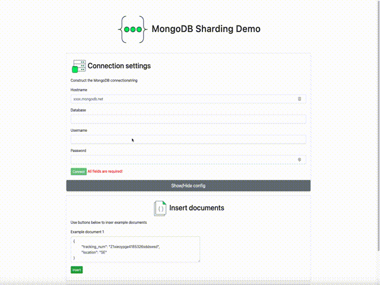
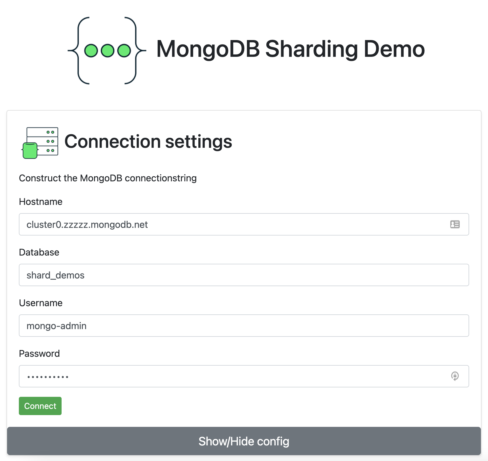
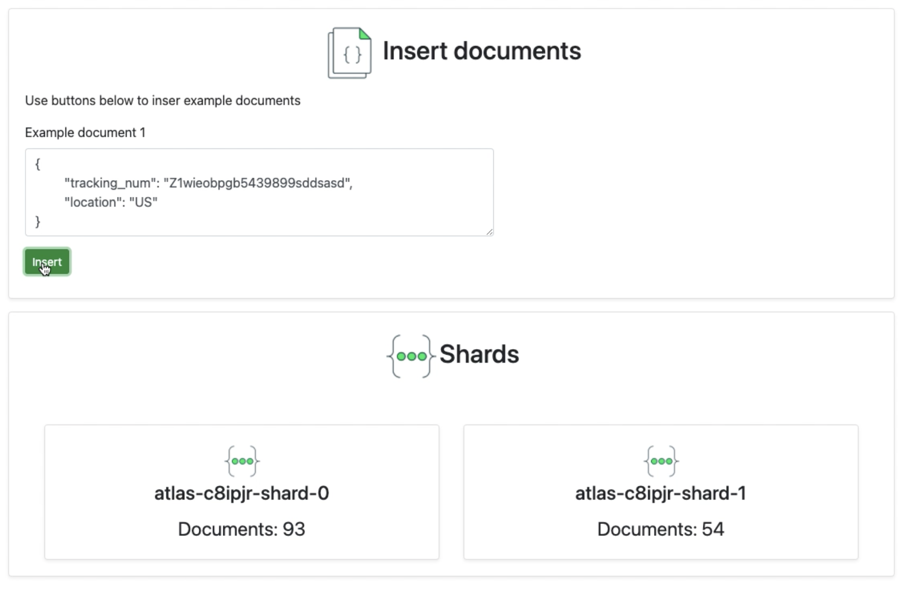

# Application to demonstrate MongoDB Zone Sharding

This applcation demonstrates the MongoDB Zone sharding capability in a visual way.
After a successfull connection to a zone sharded cluster, the user is able to inesert documents and watch as the number of documents increment on the different shards depending on data incluced in the document.



## Overview
This demo consists of three parts.
- MongoDB Sharded cluster
- NodeJs Backend
- React JS Frontend

The backends is responsible for communicating with the MongoDB cluster, the backend and frontend are connected using socket.io

## Running the demo

### 1. Start by deploying a MongoDB Zone sharded cluster, see [Global clusters](https://docs.atlas.mongodb.com/tutorial/create-global-cluster/) documentation. 

### 2. Clone this repo

### 3. Start a terminal in the `backend` subfolder and run 
```
npm install
node main.js
```

### 4. Start another terminal window in the `frontend` subfolder and run
```
npm install
npm start
```

### 5. Once the frontend is running, fill in the hostname, database, username and password for your MongoDB instance and press `connect`


### 6. Once sucessfully connected, you can hide the connection configuration using the `show/hide`button. You can now see a representaion of your shards and can insert documents using the `insert` button. 



---

Written by:  
Emil Nildersen   
Senior Solutions Architect
MongoDB

Written during SA Bootcamp 2022